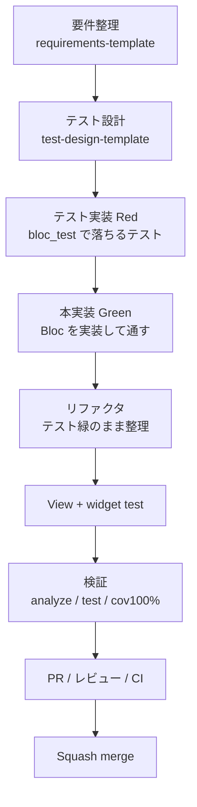

AI エージェント（GitHub Copilot / Claude Code など）で開発するとき、**「なんとなく実装させる」から一歩進んで、テストを軸にした TDD で回す**とどうなるか。
この記事では、`flutterp-test-develop` リポジトリの `counter` 機能を題材に、**要件整理 → テスト設計 → テスト実装 → 本実装 → 検証 → CI** の1周を実際に組み立てた記録をまとめます。

---

## TL;DR

- AI 駆動開発に必要なのは **①コンテキスト（地図）／②検証可能な仕様（テスト）／③小さく速いループ** の3つ。
- なかでも **②テストが最重要**。テストは「AI への曖昧さゼロの仕様書」になり、TDD と本質的に噛み合う。
- 人間は **「意図を決める・承認する・マージする」** の判断に集中し、実装の反復は AI に渡す。
- 実際に `counter` を1周させ、テンプレ・テスト・`metrics.sh`・CI ワークフローまで「動く見本」を用意した。

---

## 1. AI駆動開発に必要な3要素

| 要素 | 意味 | このリポジトリでの実体 |
| --- | --- | --- |
| ① コンテキスト（地図） | AI が毎回説明なしで規約を把握できる状態 | `AGENTS.md` + `.github/skills/` + `docs/` テンプレ |
| ② 検証可能な仕様（テスト） | AI 出力の正否を**機械判定**できる基準 | テスト設計書 + `bloc_test` + カバレッジ100%ゲート |
| ③ 小さく速いループ | 1機能を小さく切り Red→Green→Refactor | worktree セッション + CI |

ポイントは **②**。自然言語の指示は曖昧だが、テストは曖昧さゼロ。
「このテストを通して」という依頼は、AI にとって最も明確な仕様になる。だから **AI 駆動と TDD は相性が良い**。

---

## 2. TDD × AI駆動 の流れ



### 工程ごとの「人間 ⇔ AI」分担

| 工程 | 人間 | AI | ゲート |
| --- | --- | --- | --- |
| ① 要件整理 | **意図・受け入れ条件を決める** | テンプレ記入補助・観点の抜け指摘 | 受け入れ条件が埋まる |
| ② テスト設計 | 観点レビュー（承認） | 4観点でケース一覧を生成 | 観点カバレッジ100% |
| ③ テスト実装(Red) | — | `bloc_test` を書く | 期待どおり落ちる |
| ④ 本実装(Green) | — | テストを通す最小実装 | 全テスト green |
| ⑤ リファクタ | — | 重複除去・命名整理 | テスト緑のまま |
| ⑥ View | UI 目視確認 | widget test + 画面実装 | 表示テスト green |
| ⑦ 検証 | — | analyze/test/カバレッジ | 警告0・cov100% |
| ⑧ PR / マージ | **最終承認・マージ** | PR 本文・数値記載 | CI green |

人間は「①意図」「②承認」「⑧マージ」の**判断ポイントだけ**を握り、③〜⑦の反復労働は AI に渡す——これが AI 駆動 TDD の勘所です。

---

## 3. 実際に counter で一周させる

### ① 要件整理（`docs/requirements/counter.md`）

テンプレ `docs/requirements-template.md` をコピーして記入。
特に **「状態と振る舞い」** の表が、後段のテスト設計・Bloc 実装に直結します。

| フィールド | 型 | 初期値 | 説明 |
| --- | --- | --- | --- |
| count | `int` | `0` | 現在のカウント値 |

| 操作 (公開メソッド) | 対応 Event | 事前条件 | 状態の変化 |
| --- | --- | --- | --- |
| `increment()` | `CounterIncremented` | なし | count + 1 |

### ② テスト設計（`docs/test-design/counter.md`）

**正常系 / 異常系 / 境界値 / 状態遷移** の4観点で洗い出し、ケース一覧を Given/When/Then で確定。
「観点カバレッジ100%」を設計フェーズのゲートにします（異常系が無いなら「該当なし＋理由」で明示）。

| ID | 観点 | 前提 (Given) | 操作 (When) | 期待結果 (Then) |
| --- | --- | --- | --- | --- |
| TC-01 | 正常系/境界値 | 生成直後 | なし | count == 0 |
| TC-02 | 正常系 | count = 0 | `increment()` ×1 | [count: 1] |
| TC-03 | 状態遷移 | count = 0 | `increment()` ×2 | [count: 1, count: 2] |
| TC-04 | UI | Page 表示 | 描画 | "0" が表示 |
| TC-05 | UI | Page 表示 | ＋タップ | "1" が表示 |

### ③ テスト実装（`bloc_test`）

モックは使わず**実物の Bloc を直接検証**します（このリポジトリの `bloc-test` skill の規約）。

```dart
// test/counter/counter_bloc_test.dart
test('初期状態は CounterState(count: 0)', () {
  expect(CounterBloc().state, const CounterState());
});

blocTest<CounterBloc, CounterState>(
  'increment で count が 1 になる',
  build: CounterBloc.new,
  act: (bloc) => bloc.increment(),
  expect: () => const [CounterState(count: 1)],
);

blocTest<CounterBloc, CounterState>(
  'increment 2回で count が 1, 2 と積み上がる',
  build: CounterBloc.new,
  act: (bloc) => bloc..increment()..increment(),
  expect: () => const [CounterState(count: 1), CounterState(count: 2)],
);
```

Widget テストは `BlocProvider` で Bloc を供給して画面を描画します。

```dart
// test/counter/counter_page_test.dart（抜粋）
testWidgets('＋ボタンをタップするとカウントが 1 になる', (tester) async {
  await tester.pumpWidget(_wrap());
  await tester.tap(find.byIcon(Icons.add));
  await tester.pump();
  expect(find.text('1'), findsOneWidget);
});
```

### ④ 本実装（Green）

テストを通す最小の Bloc。UI は `add` を直接呼ばず、公開メソッド `increment()` を叩くのが規約です。

```dart
class CounterBloc extends Bloc<CounterEvent, CounterState> {
  CounterBloc() : super(const CounterState()) {
    on<CounterIncremented>(_onIncremented);
  }

  void increment() => add(const CounterIncremented());

  void _onIncremented(CounterIncremented e, Emitter<CounterState> emit) {
    emit(CounterState(count: state.count + 1));
  }
}
```

### ⑦ 検証（メトリクス）

`tool/metrics.sh` で物理KLOC・テスト件数・テスト密度・バグ密度を数値化します。

```sh
$ tool/metrics.sh
物理KLOC (lib)    : 0.096 KLOC
テスト件数        : 6 件
テスト密度        : 62.50 件/KLOC
バグ密度          : 0.00 件/KLOC
```

### ⑧ CI（品質ゲート）

`.github/workflows/ci.yml` が PR で **format → analyze → test → カバレッジ100%チェック** を自動実行します。
`main()` などテスト不能行は `// coverage:ignore-line` で明示的に除外。カバレッジが 100% 未満なら fail します。

---

## 4. AI駆動を成立させる3原則

1. **テストを「AI への仕様書」として使う**
   先にテストを確定させれば、「このテストを通して」が完璧な指示になる。人間はテストの妥当性だけ見ればいい。
2. **1セッション＝1つの Red→Green ループ**
   巨大タスクを丸投げすると AI は迷子になる。「この機能の Bloc を TDD で」くらいの粒度に切ると、コンテキストも汚れずコンフリクトも減る。
3. **ゲートで自動的に品質を守る**
   カバレッジ100%・警告0 といった数値ゲートが「AI 出力の合否」を機械判定する。人間が細かくレビューしなくても、通らなければマージできない。

---

## まとめ

- AI 駆動開発は **テストを仕様書にすることで安定する**。TDD はそのための最良の型。
- `counter` を1周させることで、**テンプレ・テスト・メトリクス・CI が揃った「コピーして次に使える見本」** ができた。
- 人間は判断（意図・承認・マージ）に集中し、反復は AI に渡す——この分業が AI 駆動 TDD の核心。

次の機能は、この見本の doc とテストをコピーして同じループを回すだけ。AI 駆動開発は「毎回ゼロから説明する」から「型に沿って回す」へと変わります。
