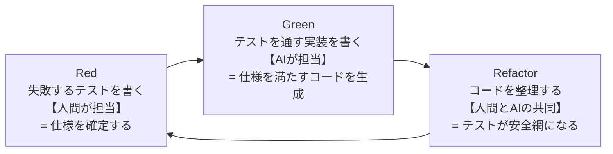

## AIコーディングの現在地：速いが、信用できない

GitHub Copilot や Claude Code といった AI コーディングツールは、コードを書く速度を劇的に変えました。関数のシグネチャを書けば中身が補完され、「カウンターアプリを作って」と依頼すれば数十秒でそれらしいコードが返ってきます。かつて数時間かかっていた実装が、数分で形になる。この体験を一度味わうと、もう元には戻れないと感じる人も多いはずです。

一方で、AI が生成したコードをそのまま本番に投入できるかというと、話は別です。AI の出力には典型的な弱点があります。もっともらしいが存在しない API を呼ぶ。エッジケース（0 や null、空リスト）の扱いが抜け落ちる。依頼していないファイルまで「親切に」書き換える。そして厄介なことに、これらの間違いは一見きれいなコードの中に紛れ込んでいるため、目視レビューでは見落としやすいのです。

つまり現在地はこうです。AI は「速く書く」問題をほぼ解決しました。しかし「正しく書けたかを確認する」問題は、むしろ以前より重くなっています。生成されるコードの量が増えた分、検証すべき量も増えたからです。

## 「動くコード」と「意図通りのコード」の乖離

ここで押さえておきたいのは、「動くコード」と「意図通りのコード」は別物だ、ということです。

AI に「カウンターに減算機能を追加して」と頼んだとしましょう。返ってきたコードはコンパイルが通り、ボタンを押せば数字が減ります。間違いなく「動くコード」です。しかし、カウントが 0 のときに押したらどうなるべきでしょうか。マイナスになってよいのか、0 で止めるべきなのか。この仕様を伝えていなければ、AI はどちらかを勝手に選びます。そしてその選択は、あなたの意図と一致しているとは限りません。

問題の根本は、自然言語の指示が本質的に曖昧なことにあります。「減算機能を追加して」という一文には、境界値の挙動も、既存機能への影響も、エラー時の振る舞いも書かれていません。人間のチームメイトなら「0 のときはどうします？」と聞き返してくれるかもしれませんが、AI は多くの場合、聞き返さずにもっともらしい解釈で埋めて進みます。

乖離は指示の瞬間だけでなく、その後も広がり続けます。機能を追加するたびに、AI が既存の挙動を壊していないかを誰かが確認しなければなりません。自然言語の依頼と目視レビューだけでこれを回し続けるのは、開発が進むほど苦しくなっていきます。

## TDDの役割の変化：品質保証の手法から、AIへの意図伝達の手法へ

テスト駆動開発（TDD）は、もともと人間のための設計・品質保証の手法として生まれました。失敗するテストを先に書き（Red）、それを通す最小の実装をし（Green）、コードを整理する（Refactor）。このサイクルを回すことで、設計が使う側の視点から磨かれ、リグレッションを防ぐ安全網が育っていきます。

AI との開発では、この TDD に新しい役割が加わります。**先に書かれたテストは、AI に対する曖昧さのない仕様書として機能する**のです。

先ほどの減算機能を思い出してください。「0 のときは何もしない」という意図は、自然言語では抜け落ちやすい一方、テストなら「count が 0 のとき decrement しても値は変わらない」と一意に書けます。テストは実行可能なので、AI の出力が仕様を満たしたかどうかを、目視ではなく機械が判定してくれます。曖昧さのない入力と、自動化された検証。AI に仕事を任せるうえで欲しかったものが、TDD にはもともと備わっていたわけです。

本書ではこの組み合わせを **テスト駆動AI開発（TDD×AI開発）** と呼びます。サイクル自体は従来の TDD と同じですが、担い手が変わります。

人間が Red を担い、仕様をテストとして確定する。AI が Green を担い、テストを通す実装を高速に生成する。Refactor は共同作業で、AI に整理を任せつつ、テストが緑のままであることが安全を保証する。役割分担がきれいに噛み合うのです。

## テストは人間が書く最後の砦であり、AIへの最良のプロンプトである

本書のコアメッセージを先に述べておきます。**テストは人間が書く最後の砦であり、AIへの最良のプロンプト（仕様書）である**。

「最後の砦」というのは、実装コードの大半を AI が書くようになっても、テストだけは人間が意図を込めて書くべき領域として残る、という意味です。テストは「このソフトウェアはこう振る舞うべきだ」という意思決定そのものであり、そこを手放すことは、何を作るかの決定権を手放すことに等しいからです。逆に言えば、テストさえ人間が握っていれば、実装の生成をどれだけ AI に任せても、開発の主導権は人間の側にあります。

「最良のプロンプト」というのは、テストがプロンプトとして理想的な性質を持っているからです。曖昧さがなく、実行して合否を判定でき、リポジトリに残り続けるため、次の変更のときも同じ仕様が AI と共有されます。チャット欄に打ち込んだ指示は流れて消えますが、テストは資産として蓄積されるのです。

:::message
テストを「書かされるもの」から「AI への指示書」へ。この視点の転換が、本書全体を貫くテーマです。
:::

ただし、テストなら何でもよいわけではありません。解像度の低いテストを渡すと、AI は「テストだけ通す手抜き実装」に平気で流れます。どんなテストが良い仕様書になるのかは、第4章で実験を通して確かめます。

## 本書の進め方：カウンターアプリ1本で全てを学ぶ理由

本書の題材は、Flutter プロジェクトを作ると最初に生成されるあのカウンターアプリ、ただ1本です。拍子抜けするかもしれませんが、これは意図的な選択です。

理由は3つあります。第一に、題材の理解にコストを払わずに済むこと。カウンターの仕様は誰でも知っているので、読者は「何を作るか」ではなく「どう作るか」、すなわちテスト駆動AI開発の進め方そのものに集中できます。

第二に、小さな題材でも本物の課題が一通り現れることです。ロジックの分離、状態管理（BLoC）への移行、デクリメントや履歴といった機能拡張、仕様変更でテストが壊れる経験、永続化という外部依存とモック、そして CI。カウンターはこれらすべてを載せられる、ちょうどよい実験台です。

第三に、1本のコードを章をまたいで育てていくことで、「テストが変更の安全網になる」感覚を連続した体験として味わえることです。章ごとに題材が変わってしまうと、この蓄積の実感は得られません。

本書の構成は次のとおりです。第2章で環境を整え、第3章ではまず人間だけで TDD のサイクルを体に入れます。第4章で AI をサイクルに迎え入れ、第5章で instructions ファイルによってチームの流儀を教えます。第6章で BLoC に移行し、第7章でテストファーストの機能拡張ラッシュ、第8章で外部依存とモック、第9章で CI をゲートにした開発フローを整え、第10章でカウンターの外の世界へ学びを一般化します。

次章では、さっそく手を動かす準備を始めます。まずは環境構築と、題材となるデフォルトカウンターの確認からです。
