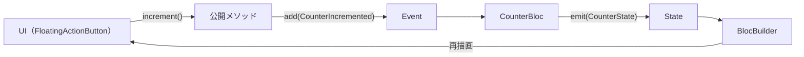

前章の instructions ファイルには「状態管理は BLoC」と書きました。本章ではそれを実行に移し、setState で動いているカウンターを Bloc で作り直します。移行は AI に任せますが、本章の主役は Bloc そのものではなく、移行の前後で**1文字も変わらず緑であり続けるテスト**です。

## なぜカウンターに状態管理を入れるのか：スケールする設計の練習

正直に言えば、カウンターに Bloc はオーバーエンジニアリングです。それでも導入する理由は2つあります。

1つ目は、**小さい題材で練習しておくため**です。状態管理の移行は、コードベースが大きくなってからでは高リスクです。ロジックが1つしかないうちに仕組みを理解しておけば、ここで書く Bloc はそのまま実務の雛形になります。

2つ目は、**「実装を大きく作り変えてもテストが守ってくれる」体験をするため**です。今の状況は「既存テストが仕様を保証した状態でアーキテクチャを差し替える」という、実務で最も神経を使うリファクタリングの縮図です。第2章で見たとおり、デフォルトの `test/widget_test.dart` は「起動時に 0、『+』タップで 1」という**ふるまい**だけを検証していました。setState が Bloc に変わってもふるまいは変わらないのだから、このテストは移行後も緑のままのはずです。本章の最後でこの予想を回収します。

## Blocの基本：Event / State / Bloc

BLoC パターンの構成要素は3つです。

- **Event**: 「何が起きたか」を表す入力。ユーザー操作など。
- **State**: 「今どういう状態か」を表す出力。UI はこれだけを見て描画します。
- **Bloc**: Event を受け取り State を返す変換器。ロジックはすべてここに集まります。

重要なのは、データが**一方向にしか流れない**ことです。UI はイベントを投げるだけで状態を直接書き換えず、新しい State を受け取って再描画するだけです。



この単方向フローにより「値がいつの間にか変わっていた」というバグが構造的に起きにくくなり、テストも**Event を入れて State を観察する**という明確な入出力の形になります。

カウンターを Bloc で書いた全文です。Event の定義に `sealed class` を使っているため、Dart 3 以降が前提です。

```dart
// lib/counter/counter_bloc.dart
import 'package:bloc/bloc.dart';
import 'package:equatable/equatable.dart';

// ===== Event =====

/// カウンターのイベント。
sealed class CounterEvent extends Equatable {
  const CounterEvent();

  @override
  List<Object?> get props => [];
}

/// 加算イベント。
class CounterIncremented extends CounterEvent {
  const CounterIncremented();
}

// ===== State =====

/// カウンターの状態。
class CounterState extends Equatable {
  const CounterState({this.count = 0});

  final int count;

  @override
  List<Object?> get props => [count];
}

// ===== Bloc =====

/// カウンターの状態管理を担う Bloc。
class CounterBloc extends Bloc<CounterEvent, CounterState> {
  CounterBloc() : super(const CounterState()) {
    on<CounterIncremented>(_onIncremented);
  }

  /// 加算する（add をラップした入口＝公開メソッド）。
  void increment() => add(const CounterIncremented());

  void _onIncremented(CounterIncremented event, Emitter<CounterState> emit) {
    emit(CounterState(count: state.count + 1));
  }
}
```

補足を3つ。`sealed class` によりイベントの種類がこのファイルに閉じ、将来の `switch` の網羅漏れを静的に検出できます。`CounterState` は `Equatable` を継承した不変クラスで、「count が同じなら同じ State」という値としての等価性を持ちます。そして `increment()` は第5章の規約で定めた**公開メソッド（add をラップした入口）**で、UI 側はイベントクラスの存在を知らずに済みます。

UI 側は `main.dart` の `BlocProvider` で `CounterBloc` を提供し、画面は `BlocBuilder` で State を購読します。

```dart
// lib/main.dart（抜粋）
import 'package:flutter/material.dart';
import 'package:flutter_bloc/flutter_bloc.dart';

import 'counter/counter_bloc.dart';

void main() => runApp(const MyApp());

class MyApp extends StatelessWidget {
  const MyApp({super.key});

  @override
  Widget build(BuildContext context) {
    return MaterialApp(
      title: 'Flutter Demo',
      home: BlocProvider(
        create: (_) => CounterBloc(),
        child: const CounterPage(title: 'Flutter Demo Home Page'),
      ),
    );
  }
}

class CounterPage extends StatelessWidget {
  const CounterPage({super.key, required this.title});

  final String title;

  @override
  Widget build(BuildContext context) {
    return Scaffold(
      appBar: AppBar(title: Text(title)),
      body: Center(
        child: Column(
          mainAxisAlignment: MainAxisAlignment.center,
          children: [
            const Text('You have pushed the button this many times:'),
            BlocBuilder<CounterBloc, CounterState>(
              builder: (context, state) {
                return Text(
                  '${state.count}',
                  style: Theme.of(context).textTheme.headlineMedium,
                );
              },
            ),
          ],
        ),
      ),
      floatingActionButton: FloatingActionButton(
        onPressed: () => context.read<CounterBloc>().increment(),
        tooltip: 'Increment',
        child: const Icon(Icons.add),
      ),
    );
  }
}
```

`StatefulWidget` と `setState` が消え、FAB がやることは `context.read<CounterBloc>().increment()` を呼ぶことだけになりました。第5章の規約「UI はロジックを持たない」がコードの形で実現されています。

## blocTest でふるまいをテストする

Bloc のテストには、第2章で導入した bloc_test パッケージの `blocTest` を使います。

```dart
// test/counter/counter_bloc_test.dart
import 'package:bloc_test/bloc_test.dart';
import 'package:flutter_test/flutter_test.dart';

import 'package:counter_app/counter/counter_bloc.dart';

void main() {
  test('初期状態は CounterState(count: 0) である', () {
    expect(CounterBloc().state, const CounterState());
  });

  blocTest<CounterBloc, CounterState>(
    'CounterIncremented で count が 1 になる',
    build: CounterBloc.new,
    act: (bloc) => bloc.add(const CounterIncremented()),
    expect: () => const [CounterState(count: 1)],
  );
}
```

`blocTest` は「build で Bloc を作り、act でイベントを流し、expect で emit された State を検証する」という定型、いわば API に埋め込まれた given / when / then を提供します。押さえてほしいポイントが3つあります。

**1つ目は、`build:` に渡している `CounterBloc.new` です。** これはコンストラクタのメソッド参照で、`() => CounterBloc()` と同じ意味です。引数なしで生成できる Bloc ならこの書き方が最も簡潔です（第8章で依存を注入するようになるとクロージャ形式に変わります）。

**2つ目は、`expect:` が emit される State の「リスト」だという点です。** `blocTest` は act の間に emit されたすべての State を順番どおり記録し、リストとして比較します。イベント1つで State が2回変わるなら2要素書きます。State の変化の系列そのものが検証対象です。

**3つ目は、現在と等しい State は再 emit されない、という Bloc の性質です。** `Equatable` で等価性を定義しているため、一度でも State を emit した後は、現在と等しい State を emit してもリスナーには通知されず、`expect:` のリストにも現れません。ただし例外が1つあります。**生成直後の最初の emit に限っては、初期状態と等価な State でも通知されます**（初期状態をリスナーへ知らせられるようにするための仕様です）。この性質と例外の組み合わせは、第7章でデクリメントの下限値を実装するときに効いてきます。

なお、初期状態のテストが素の `test` なのは、初期状態が「イベントを流した結果」ではなく「生成直後の値」だからです。道具は適材適所で使い分けます。

## 既存テストを仕様書として、AIにBloc移行をさせる

実際の手順はテストファーストです。人間がやることは、上の `counter_bloc_test.dart` を書いて Red にすることと、AI に移行を依頼することの2つだけです。

> test/counter/counter_bloc_test.dart を追加しました。このテストが通るように、Counter クラスを CounterBloc に置き換えて、main.dart も Bloc を使う形に移行してください。プロジェクト規約に従うこと。test/widget_test.dart は変更しないでください。

ポイントは3つです。第一に、仕様の詳細を文章で説明していません。イベント名も State の形も初期値も、すべてテストコードが語っています。第二に、アーキテクチャの流儀も説明していません。それは instructions ファイルの仕事です。第三に、「widget_test.dart は変更しない」と明示しています。AI は詰まると既存テストの書き換えに手を伸ばす傾向があるため、安全網そのものを固定しておくのです。

GitHub Copilot でも Claude Code でも、この条件が揃っていれば、典型的には先ほどのコードとほぼ同じ構造の実装が返ってきます。細部の揺れはあっても、Event / State / Bloc の分離や公開メソッド `increment()` の提供といった骨格は、テストと規約からほぼ一意に定まります。第4章で見た「テストの解像度が実装の自由度を決める」原則が、アーキテクチャ移行へとスケールした形です。

`flutter test` で Green を確認したら、役目を終えた旧 `Counter` クラス（`lib/counter/counter.dart`）と `test/counter/counter_test.dart` は削除します。同じ仕様は今や `counter_bloc_test.dart` が語っており、役目を終えたテストを残すのは二重帳簿を持つのと同じだからです。

:::message
削除の前に、旧テストのケース（初期値 0 / 1回で 1 / 2回で 2）が新テストでカバーされていることを確認してください。テスト削除は「同じ仕様が新しいテストで語られていること」が条件です。
:::

## テストが通り続ける限り、内部実装は自由に変えられる

最後に、第2章からの伏線を回収します。`flutter test` の結果をよく見ると、新しく書いた Bloc のテストだけでなく、**デフォルトの `test/widget_test.dart` が1文字も変わらないまま緑のまま**です。

これは偶然ではありません。あのテストは画面から観察できるふるまいだけを検証し、`_counter` フィールドにも `setState` にも触れていないからです。だからこそ、状態管理を総取り替えする大手術の間も仕様の番人であり続けました。もし移行中に AI が「タップしても値が増えない」コードを書けば、即座に Red で教えてくれたはずです。

対照的に、第3章の `counter_test.dart` は `Counter` クラスという実装上の構造物に結びついていたため、移行と同時に書き換えが必要になりました。どちらが悪いという話ではなく、ユニットテストは実装の単位に寄り添って解像度を上げ、ふるまいベースのテストは実装から距離を置いて仕様を守る。この二層があるからこそ、内側を自由に作り替えられるのです。

**ふるまいに対するテストは、リファクタリングの安全網であると同時に、AIに内部実装の自由を与える契約書でもあります。**「この入出力さえ守れば中はどう書いてもよい」という契約が明文化されているから、人間は AI の移行コードを1行ずつ疑わなくても、テストの結果で受け入れ判断ができるのです。

カウンターは Bloc になり、安全網の張り方も分かりました。次章では、この土台の上にデクリメント・リセット・履歴と機能を一気に増築します。テストファーストの真価が出るのは、まさにこの「変更が続く」フェーズです。
