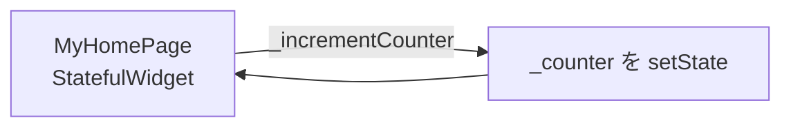
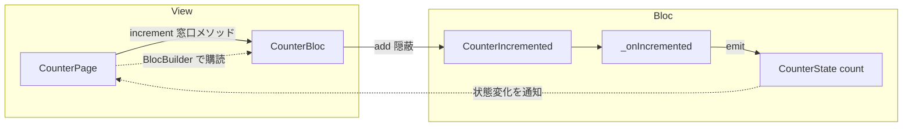
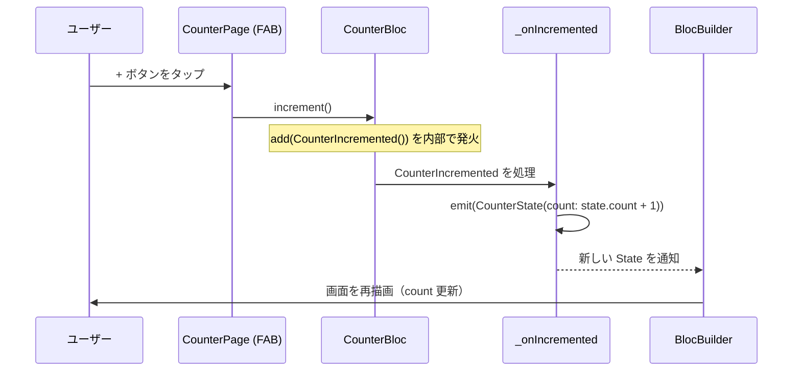

# Claude Code で Skills を整備し、Flutter アプリを BLoC 化してマージするまで

このリポジトリ（`flutterp-test-develop`）で実際に行った一連の作業を、記事としてまとめます。
「AI エージェント向けのルール（AGENTS.md / Skills）を別リポジトリから移植し、その規約に沿ってアプリを BLoC で実装し、PR を作ってマージする」までの流れです。

---

## TL;DR

1. 別リポジトリ `flutter-test-app` の **AGENTS.md** と **Skills** を、同じ構成でこのリポジトリへ同期した。
2. 同期した **bloc / bloc-state スキルの規約に沿って**、デフォルトの `setState` カウンターを **BLoC パターン**へ移行した。
3. 1本のブランチにまとめてコミット → プッシュ → **PR #1** を作成 → **squash merge** で `main` に取り込んだ。

---

## 1. 移行前後のアーキテクチャ

### Before: `setState` 版



状態（`_counter`）とその更新ロジックが Widget 内に閉じており、UI と状態管理が密結合でした。

### After: BLoC 版



- **状態の保持・更新は Bloc が担当**（Widget は状態を持たない）。
- UI は `add` を直接呼ばず、Bloc が公開する **窓口メソッド `increment()`** を呼ぶ。
- `CounterState` は `Equatable` による**不変クラス**。`BlocBuilder` が状態変化を購読して再描画する。

---

## 2. ランタイムのデータフロー（ボタンを押したとき）



`UI → 窓口メソッド → Event → ハンドラ → emit(State) → BlocBuilder 再描画` という単方向の流れになっています。

---

## 3. 同期した Skills と AGENTS.md

| ファイル | 役割 |
| --- | --- |
| `AGENTS.md` | エージェントが常に従う基本ルール（概要 / アーキテクチャ / 規約 / ブランチ戦略） |
| `.claude/skills/bloc/SKILL.md` | Event + State + Bloc を1ファイルに作る規約 |
| `.claude/skills/bloc-state/SKILL.md` | `Equatable` な不変 State の規約 |
| `.claude/skills/bloc-test/SKILL.md` | `bloc_test` でのテストの書き方 |
| `.claude/skills/test-workflow/SKILL.md` | 設計書→実装→検証→レビュー→CI→マージの品質ワークフロー |

これらは Claude Code が認識できる `.claude/skills/<name>/SKILL.md` の構成で配置しています。
「依頼に対してどのスキルを使うか」をエージェントが自動で選び、その規約どおりに実装する、という流れを支えます。

---

## 4. 実装の要点（規約への準拠）

`lib/counter/counter_bloc.dart` に Event / State / Bloc を**1ファイルへ集約**しました。

```dart
// ===== Event =====
sealed class CounterEvent extends Equatable {
  const CounterEvent();
  @override
  List<Object?> get props => [];
}

class CounterIncremented extends CounterEvent {
  const CounterIncremented();
}

// ===== State =====
class CounterState extends Equatable {
  const CounterState({this.count = 0});
  final int count;
  @override
  List<Object?> get props => [count];
}

// ===== Bloc =====
class CounterBloc extends Bloc<CounterEvent, CounterState> {
  CounterBloc() : super(const CounterState()) {
    on<CounterIncremented>(_onIncremented); // メソッド参照で登録
  }

  /// add を隠蔽した窓口メソッド。
  void increment() => add(const CounterIncremented());

  void _onIncremented(CounterIncremented event, Emitter<CounterState> emit) {
    emit(CounterState(count: state.count + 1));
  }
}
```

規約に沿って意識した点:

- **1ファイル集約**：Event を別ファイルに分割しない／Facade を作らない。
- **メソッド参照で登録**：`on<...>(_onIncremented)`（インラインのラムダにしない）。
- **窓口メソッド**：UI は `add` を直接書かず `increment()` を呼ぶ。
- **未使用物を持ち込まない**：UI が加算のみのため `decrement()` は実装しない。

---

## 5. 学び

- **AGENTS.md / Skills は「実装の地図」**：ルールを先に整備しておくと、後続の実装が一貫した形に収束する。
- **ドキュメントと実装が同じ規約で揃う**：「Squash merge で main へ」のような運用ルールまで実作業に反映できた。
- **小さく区切って進める**：同期 → 実装 → マージを段階的に。各段で意図を確認しながら進められた。

---

> このリポジトリは Flutter（BLoC + Equatable）構成です。次の一歩としては、`test-workflow` スキルに沿った CI（`flutter analyze` / `flutter test --coverage`）の整備が候補になります。
