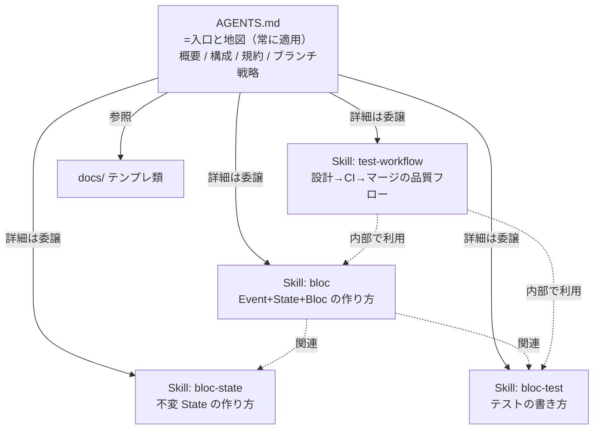
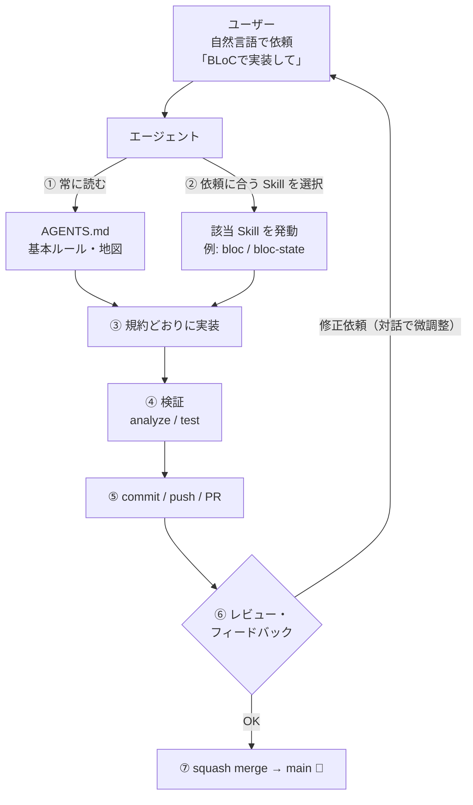

# バイブコーディングと、AGENTS.md × Skills の関係

「バイブコーディング（vibe coding）」＝自然言語でエージェントと対話しながら、動くものを見つつ会話で仕上げていく開発スタイルです。
この記事では、その一連の流れと、土台になる **`AGENTS.md`** と **Skills** の関係を図解します。

---

## TL;DR

- **`AGENTS.md` = 地図**：常に効く「広く浅い」プロジェクトの憲法（概要・構成・規約・ブランチ戦略）。
- **Skills = 手順書**：依頼にマッチしたときだけ開く「狭く深い」How-to（bloc の作り方、テストの書き方 など）。
- バイブコーディングは「**ルール（AGENTS.md）＋手順（Skills）を土台に、自然言語で反復して仕上げる**」流れ。

---

## 1. AGENTS.md と Skills の関係

`AGENTS.md` が「入口」で、そこから各 Skill へ枝分かれします。
本質ルールだけ `AGENTS.md` に残し、具体的な手順は Skills に切り出すことで、`AGENTS.md` の肥大化を防ぎます。

### 役割の違い

| | AGENTS.md | Skills |
| --- | --- | --- |
| 役割 | **What / Where**（何を・どこで） | **How**（どう実装するか） |
| 粒度 | 広く浅い（プロジェクト全体の憲法） | 狭く深い（特定タスクの手順書） |
| 発動 | **常に**読み込まれる | 依頼に**マッチしたときだけ**発動 |
| 例 | 「BLoC + Equatable を使う」「main に直接コミットしない」 | 「`sealed class Event` にする」「`on<E>(_onX)` で登録」 |
| 関係 | 詳細を Skills / docs に**委譲** | Skills 同士も相互**参照**（例: test-workflow → bloc-test） |

---

## 2. バイブコーディングの一連の流れ

自然言語の依頼から、`AGENTS.md` と Skills がどこで効くかを重ねた図です。

### 流れのポイント

1. **① AGENTS.md は毎回のベースライン** — 依頼の内容に関わらず、まず「このプロジェクトの前提・規約」を押さえる。
2. **② Skill は依頼に応じて発動** — 「BLoCで実装して」なら `bloc` スキルが起動し、`sealed` イベントやメソッド参照登録といった具体規約が適用される。
3. **③〜⑤** ルール＋手順に沿って実装・検証・PR。
4. **⑥ 対話で微調整** — ここが“バイブ”の核。完璧な仕様を最初に固めず、動くものを見ながら会話で寄せていく。
5. **⑦ 合意できたらマージ**。

---

## 3. なぜこの分担が効くのか

- **コンテキストの節約**：毎回すべての手順を読ませる代わりに、`AGENTS.md` の地図だけ常時読み、必要な Skill だけ展開する。
- **一貫性**：ルールを先に整備しておくと、誰が（人でもエージェントでも）実装しても同じ形に収束する。
- **保守性**：手順が変わったら該当 Skill だけ直せばよい。`AGENTS.md` は安定した憲法として保てる。

> まとめ：**`AGENTS.md` で「どこへ向かうか」を示し、Skills で「どう作るか」を渡す。**
> あとは自然言語の対話で、動くものを見ながら仕上げていく — これがバイブコーディングの型です。
