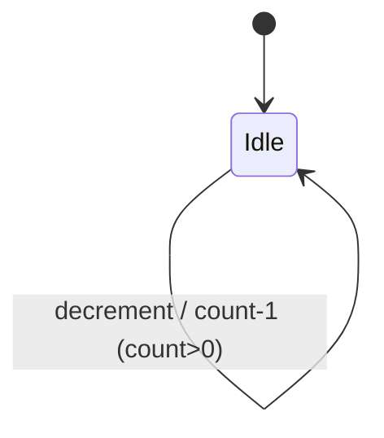

<!--
要件整理テンプレート

TDD ワークフローの起点（要件整理 → テスト設計 → テスト実装 → 本実装 → 検証）。
このファイルをコピーして `docs/requirements/<feature>.md` などに配置し、機能ごとに記入する。
記入が終わったら、この内容をもとに docs/test-design-template.md でテスト設計書を作成する。

- 対象読者: 実装・テストを担当する人／エージェント
- 目的: 「何を作るか」を実装前に言語化し、観点漏れ・手戻りを防ぐ
- 関連: .github/skills/test-workflow, docs/test-design-template.md
-->

# 要件整理: <機能名>

| 項目 | 内容 |
| --- | --- |
| 機能名 | 例: カウンター |
| 対象 (Bloc / Page) | 例: `CounterBloc` / `CounterPage` |
| 配置予定 | 例: `lib/counter/` |
| 作成日 / 記入者 | YYYY-MM-DD / |
| ステータス | ドラフト / レビュー中 / 確定 |

## 1. 目的・背景

<!-- なぜこの機能が必要か。解決したい課題を1〜3行で。 -->

## 2. ユーザーストーリー

<!-- 「<誰> として <何> をしたい。なぜなら <理由> だから」形式で書く。 -->

- ... として ... したい。なぜなら ... だから。

## 3. 機能要件（やること）

<!-- 箇条書きで、検証可能な粒度に落とす。 -->

- [ ] ...
- [ ] ...

## 4. スコープ外（やらないこと）

<!-- 誤解を防ぐため、今回やらないことを明示する。 -->

- ...

## 5. 状態と振る舞い（BLoC 設計の材料）

> ここが後段のテスト設計・Bloc/State 実装に直結する。可能な限り具体的に。

### 5.1 状態（State が持つ値）

| フィールド | 型 | 初期値 | 説明 |
| --- | --- | --- | --- |
| 例: count | `int` | `0` | 現在のカウント値 |

### 5.2 操作（Bloc が公開するメソッド / Event）

| 操作 (公開メソッド) | 対応 Event | 事前条件 | 状態の変化 |
| --- | --- | --- | --- |
| 例: `increment()` | `CounterIncrementPressed` | なし | count + 1 |
| 例: `decrement()` | `CounterDecrementPressed` | count > 0 | count - 1 |

### 5.3 状態遷移（必要なら図）

## 6. 画面・UI 要件

<!-- 表示要素、レイアウト、操作導線。UI 変更時は before/after を想定して書く。 -->

- 表示: ...
- 操作: ...

## 7. 制約・非機能要件

<!-- パフォーマンス、対応プラットフォーム、依存パッケージ、アクセシビリティ等。 -->

- 対応プラットフォーム: Android / iOS / Web / desktop（必要なもの）
- 依存パッケージ: `flutter_bloc`, `equatable` 等
- その他: ...

## 8. 受け入れ条件（Acceptance Criteria）

> テスト設計・テスト実装が満たすべき「完了の定義」。ここが観点洗い出しの入口になる。

- [ ] （正常系）...
- [ ] （異常系）...
- [ ] （境界値）...
- [ ] （状態遷移）...

## 9. テスト観点の種（テスト設計への引き継ぎ）

<!-- 8 の受け入れ条件を、テスト設計書の「観点」に橋渡しするメモ。 -->

| 観点カテゴリ | 洗い出したい点 |
| --- | --- |
| 正常系 | ... |
| 異常系 | ... |
| 境界値 | ... |
| 状態遷移 | ... |

## 10. 未決事項・確認事項

<!-- 仕様上の疑問、要確認の点。確定したら本文へ反映する。 -->

- [ ] ...
