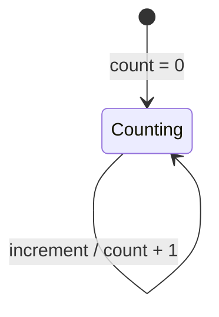

<!-- docs/requirements-template.md を counter 機能向けに記入した「見本」。AI駆動TDDの起点。 -->

# 要件整理: カウンター

| 項目 | 内容 |
| --- | --- |
| 機能名 | カウンター |
| 対象 (Bloc / Page) | `CounterBloc` / `CounterPage` |
| 配置予定 | `lib/counter/` |
| 作成日 / 記入者 | 2026-07-05 / （記入例） |
| ステータス | 確定 |

## 1. 目的・背景

ボタン押下で数値を数え上げる、アプリの最小サンプル機能。
BLoC パターンと AI駆動TDD フローの「動く見本」を示すことを目的とする。

## 2. ユーザーストーリー

- 利用者として、ボタンを押した回数を画面で確認したい。なぜなら操作の反映を目で見て確かめたいから。

## 3. 機能要件（やること）

- [x] 起動時のカウントは 0 で表示される。
- [x] 加算ボタンを押すと、カウントが 1 増える。
- [x] 現在のカウントが画面に常に表示される。

## 4. スコープ外（やらないこと）

- 減算・リセット（本サンプルでは扱わない）。
- カウントの永続化（アプリ再起動で 0 に戻る）。

## 5. 状態と振る舞い（BLoC 設計の材料）

### 5.1 状態（State が持つ値）

| フィールド | 型 | 初期値 | 説明 |
| --- | --- | --- | --- |
| count | `int` | `0` | 現在のカウント値 |

### 5.2 操作（Bloc が公開するメソッド / Event）

| 操作 (公開メソッド) | 対応 Event | 事前条件 | 状態の変化 |
| --- | --- | --- | --- |
| `increment()` | `CounterIncremented` | なし | count + 1 |

### 5.3 状態遷移

## 6. 画面・UI 要件

- 表示: 説明テキスト + 現在のカウント値（`headlineMedium`）。
- 操作: 右下の FloatingActionButton（＋アイコン）で加算。

## 7. 制約・非機能要件

- 対応プラットフォーム: Android / iOS / Web / desktop（Flutter 標準）。
- 依存パッケージ: `bloc`, `flutter_bloc`, `equatable`。
- UI は Bloc のイベントを直接 add せず、公開メソッド `increment()` を呼ぶ。

## 8. 受け入れ条件（Acceptance Criteria）

- [x] （正常系）初期状態で count == 0。
- [x] （正常系）increment 1回で count == 1。
- [x] （状態遷移）increment 2回で count == 2。
- [x] （UI）初期表示が "0"、加算後に "1" が表示される。

## 9. テスト観点の種（テスト設計への引き継ぎ）

| 観点カテゴリ | 洗い出したい点 |
| --- | --- |
| 正常系 | 初期状態 / 1回加算 |
| 異常系 | 該当なし（外部入力・失敗経路が無いため） |
| 境界値 | 初期値 0（加算前） |
| 状態遷移 | 連続加算での積み上がり |

## 10. 未決事項・確認事項

- なし（サンプルのため仕様は固定）。
